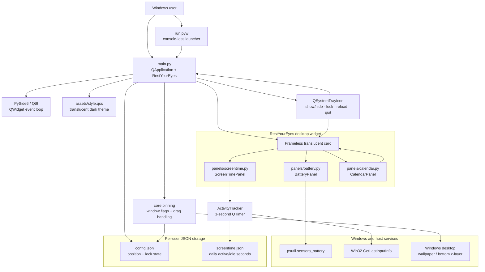

# Architecture overview

Rest Your Eyes is a Windows desktop widget built with Python and PySide6. The application combines a desktop-pinned Qt window with battery status, active/idle screentime tracking, and an interactive calendar, while persisting widget settings and daily activity data under `%APPDATA%\RestYourEyes\`.

## Runtime flow

1. `run.pyw` or `main.py` starts the Qt event loop and loads `assets/style.qss`.
2. `RestYourEyes` assembles the card from `BatteryPanel`, `ScreenTimePanel`, and `CalendarPanel`, then applies desktop window flags from `core.pinning`.
3. `BatteryPanel` refreshes `psutil.sensors_battery()` every five seconds. `ActivityTracker` samples Windows idle time every second through `core.idle.get_idle_seconds()`, classifies time as active or idle, and periodically saves daily totals through `core.storage`.
4. Dragging and tray actions update widget visibility, lock state, and position; configuration and screentime data are atomically written as JSON in `%APPDATA%\RestYourEyes\`.

## Main modules

- `main.py` — application entry point, widget composition, tray menu, reload behavior, and stylesheet loading.
- `core/pinning.py` — frameless, translucent, bottom-layer window behavior and drag-to-move event filtering.
- `core/idle.py` — Windows `GetLastInputInfo` integration.
- `core/storage.py` — atomic JSON persistence for configuration and screentime history.
- `panels/battery.py` — battery percentage, charging state, progress bar, and smoothed remaining-time display.
- `panels/screentime.py` — active/idle tracker and screentime presentation.
- `panels/calendar.py` — mouse-driven month/year navigation built on `QCalendarWidget`.
